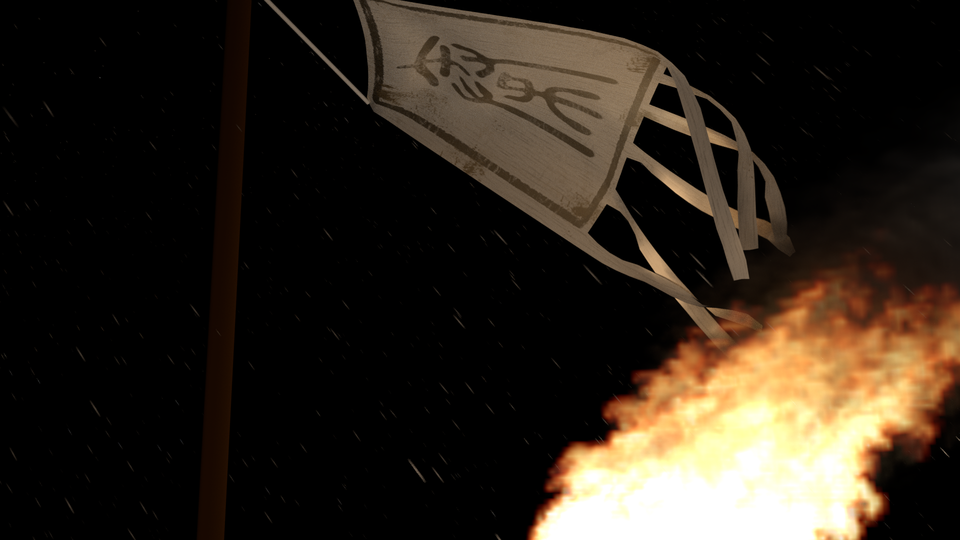

# Gallery: Blender

<a class="button_blue_bordered" href="gallery.html">Back to Gallery Index</a>

As could be known, [Blender](http://www.blender.org) is an open source 3D
modelling and animation software. I am still learning to use this software kit,
especially on the materials, lightings and use of particle systems.

## "Flag and Flame"

This is a practice on UV mapping and quick smoke effect in blender. As the type
of flame was set to "volume" rather than "particle", it could be seen that the
quality of flame is not very satisfying. The map on the flag is also a plain
one.
