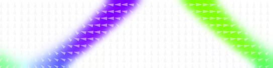
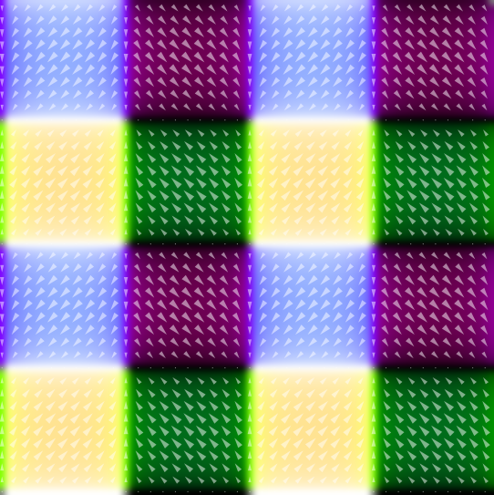

# Gallery: Phase Field

<a class="button_blue_bordered" href="gallery.html">Back to Gallery Index</a>

This page compiles several pictures from the phase field simulation practices on
ferroelectrics. Small Python scripts were deployed to map the direction of
polarizations to points in HSV color space. The style was trying to mimic the
output of [MuMax](http://mumax.github.io), a micromagnetics simulation software
kit.

## a-c Domain Polarization

This domain type is known as a-c domain structure observed in experiments. This
domain structure was successfully reproduced in phase field simulation by Li et
al. This certain piece of result was based on my practice with C++
implementation. The potential used corresponds to PbTiO3 (lead titanite).

## Test Tiles

Test for ODE solvers based on Fourier spectrum method requires some simple test
cases. Other than random noises, some more obvious test cases are better
choices. This case with different polarization cells (or "tiles") is among
these choices.

## "Toxic Flame"

This picture actually came out by accident. This stucture was the intermediate
result of BiFeO3, with a physically non-favourable initial polarization
configuration, which could not be happening in real cases. However this pattern
is still beautiful regardless of its correctness.